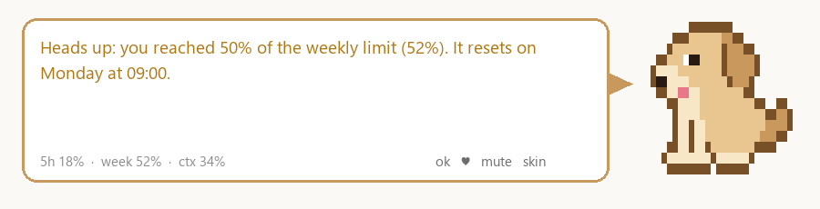
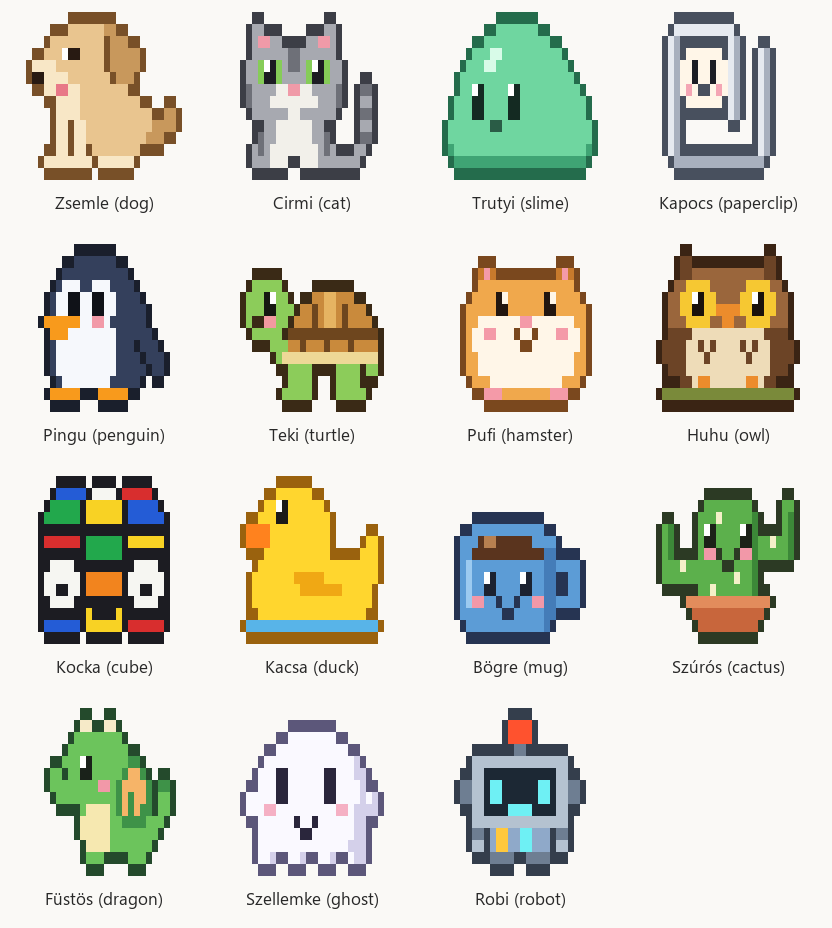
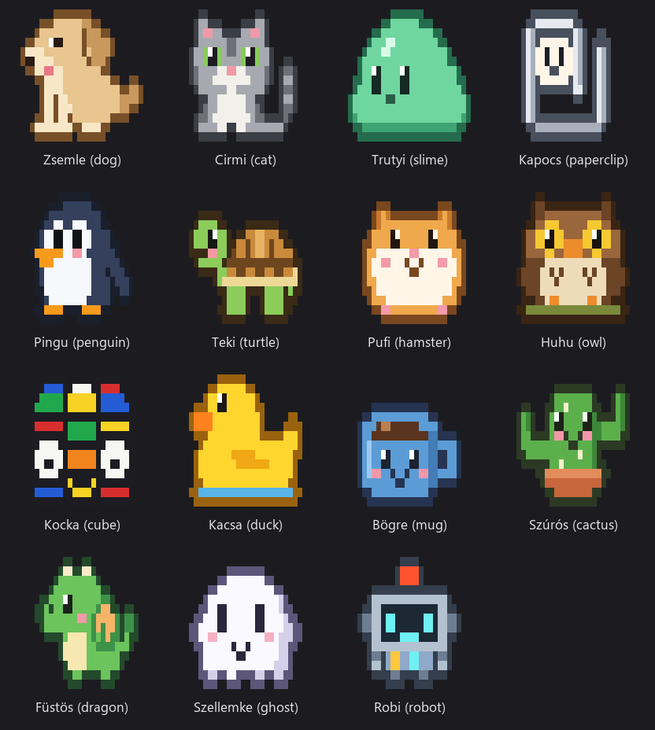
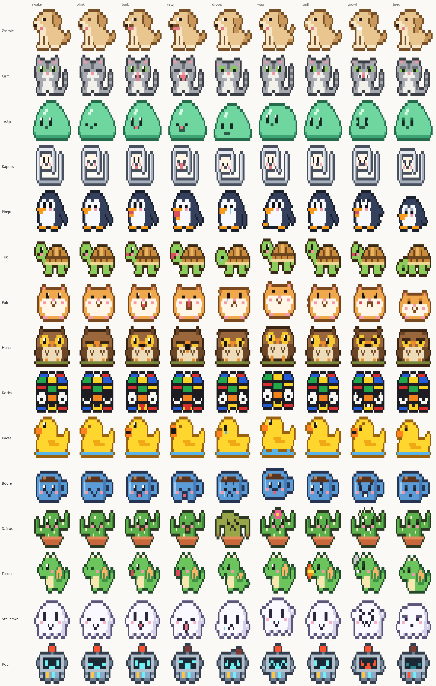
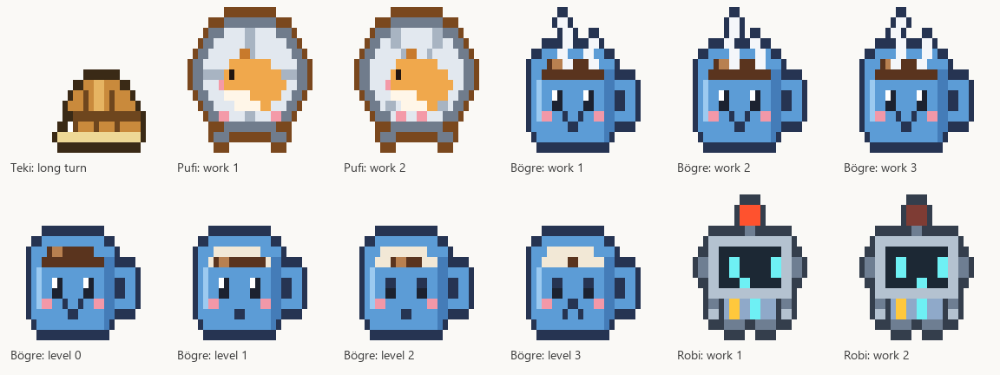

# Zsemle

**A pixel-art companion for Claude Code that sits above your prompt and keeps an eye on your usage limits.**

Zsemle watches the 5-hour and weekly windows, the context, API errors and your session cost, tells you in a little speech bubble when something matters, and stops the work at 95% so you never hit the wall mid-task. It also guards file writes, sniffs after deploys, warns about port clashes, and gets visibly tired as your limit runs low. Pick one of 15 figures; it works in the terminal and in the desktop app's Code tab alike.

*Magyar leírás lent.*



## Contents

- [Figures](#figures)
- [What it watches](#what-it-watches)
- [Optional features](#optional-features)
- [Install](#install)
- [Commands](#commands)
- [Settings](#settings)
- [Troubleshooting](#troubleshooting)
- [Privacy](#privacy)
- [Magyarul](#magyarul)

## Figures



The same figures as the terminal draws them (quadrant-block characters, two colors per cell):



| name | figure | its own trick |
| --- | --- | --- |
| `dog` | golden retriever puppy (default) | wags its tail, barks when a long turn ends |
| `cat` | grey tabby cat | meows, hisses at a blocked write |
| `slime` | jelly slime | wobbles when happy |
| `paperclip` | paperclip with a face | hops |
| `penguin` | penguin | waddles when your tests pass |
| `turtle` | turtle | pulls its head in during turns longer than 3 minutes |
| `hamster` | hamster | runs in its wheel while the model works |
| `owl` | owl | after 22:00 it tells you to close the day |
| `cube` | Rubik's cube with eyes | clicks |
| `duck` | rubber duck | quacks, listens to your bug explanation |
| `mug` | coffee mug | steams while the model works, empties as the limit runs low |
| `cactus` | potted cactus | blooms on green tests, wilts on errors |
| `dragon` | little dragon | roars, breathes fire after a deploy |
| `ghost` | ghost | fades when you are idle |
| `robot` | robot | beeps, its antenna blinks while the model works |

Every figure has its own sound (barks, meows, quacks, hoots, a roar, beeps...), played when a long turn ends (`/zsemle bark` to test it, `/zsemle mute` to silence it).

Every figure has 9 poses (awake, blink, speaking, yawn, sad, happy, alert, angry, tired):



and some have special frames (work animation, long turn, fatigue levels):



Switch figures with `/zsemle skin` (a pane with previews: click one), `/zsemle skin penguin`, the bubble's `skin` button, or the `zsemle.skin` row in `/config` (there the figures go by their short ids: `zsemle` is the dog, `pingvin` the penguin and so on; `/zsemle skin` lists both).

## What it watches

| signal | what Zsemle does |
| --- | --- |
| 5-hour, weekly and spend limits | heads-up at 50%, stronger at 75%, red at 90%; at 95% it stops tool calls and prompts until the window resets (`/zsemle wake` overrides for the session). Every threshold crossed raises a toast with the reset time. |
| pace | if the window runs out before it resets at the current pace, it tells you roughly when |
| reset | cheers when a window is full again |
| API errors | explains rate limit, overload, output token limit, billing, login, unavailable model and server errors in plain words |
| automatic model switch | tells you when the engine fell back to another model |
| automatic compaction | tells you when the context was compacted, warns at 90% before it happens |
| context | tired at 60%, asks for a status note before `/compact` at 80% |
| cost | on API-key use (no subscription windows), speaks up at 1, 5, 10, 20, 50, 100 and 200 dollars |
| status line | `5h 18% · week 52% · ctx 34%` under the prompt (`/zsemle bar off` hides it) |

Also: a sound when a turn longer than 3 minutes finishes, a content guard (curly quotes as JS string delimiters, emoji in code, secrets such as API keys, tokens and private keys outside `.env`, and optionally em/en dashes), a deploy sniff that reminds the model to check the live state, a call-out when the same command keeps failing, a port guard for two dev servers on one port, a nudge to commit when many files are changed, a break reminder after 90 minutes, sleep when idle, pets and daily stats.

## Optional features

All on by default; switch any of them off in `/config` or with `/zsemle feature <name> off`, for example `/zsemle feature commitGuard off`. `/zsemle features` lists them with their state.

| feature | what it does |
| --- | --- |
| `fatigueLook` | the figure gets tired as the worst window fills (heavier eyes from 75%), fresh again after a reset: you can read the limit at a glance |
| `budgetPlanner` | splits the weekly window into daily shares (the rest over the days left) and warns in the evening when today went over; `/zsemle limit` shows today's share |
| `modelAdvice` | a simple task (rename, format, typo, translate...) on a big model at a high limit: suggests `/model sonnet` |
| `contextSaver` | above 70% context, asks the model for shorter answers and smaller file reads |
| `commitGuard` | stops a `git commit` once when no test ran since the last edit; repeat the commit within 2 minutes to go ahead |
| `loopWatch` | speaks up when the model edits the same file a fifth time in one turn |
| `morningBrief` | the first prompt of the day carries a short brief: yesterday's summary, projects waiting to ship (from `projectTable`), today's budget |
| `lessonSniff` | when the same error comes back in a third turn, suggests recording it as a lesson |
| `daySummary` | when you sign off ("thanks, that's all"), asks for a short summary of the day and keeps it for the next morning's brief |

Two more need no switch: `/zsemle ask <question>` answers from your limits and stats with a small model, and `/zsemle week` shows a weekly activity chart (tool calls per hour) in a pane.

## Install

Zsemle is a Claude Code mod (function-hooks plugin). It needs a recent Claude Code with plugin hooks support (tested on 2.1.286), in the terminal or the desktop app's Code tab.

1. Add the marketplace and install the plugin, in Claude Code:

   ```
   /plugin marketplace add Parais4/parais-mods
   /plugin install zsemle@parais-mods
   ```

2. Start a new session (or run `/plugin` and reload). Zsemle appears above the prompt on the right.
3. Optional: open `/config` and set `zsemle.language` to `hu` for Hungarian, pick a `zsemle.skin`, and switch features on or off.

Update: `/plugin marketplace update parais-mods`, then start a new session. Remove: `/plugin uninstall zsemle@parais-mods`.

Run it from a local folder instead (for hacking on it): clone this repo and start Claude Code with `claude --plugin-dir plugins/zsemle`, or point the `CLAUDE_CODE_PLUGIN_DIRS` environment variable at that folder. Check it with `claude plugin validate plugins/zsemle` and `claude plugin test plugins/zsemle`.

## Commands

| English | Hungarian | what |
| --- | --- | --- |
| `/zsemle` | | status and help |
| `/zsemle limit` | | every window, the pace, today's budget, the context and the cost |
| `/zsemle skin` | | the figure picker pane |
| `/zsemle skin <name>` | `/zsemle skin <név>` | wear a figure, e.g. `penguin` (`next` steps through them) |
| `/zsemle ask <q>` | `/zsemle kerdes <k>` | ask Zsemle (small model) |
| `/zsemle week` | `/zsemle heti` | weekly activity chart |
| `/zsemle summary` | `/zsemle napzaro` | a summary of this session (small model) |
| `/zsemle features` | `/zsemle kapcsolok` | the optional features and their state |
| `/zsemle feature <name> off/on` | `/zsemle kapcsolo <név> ki/be` | switch one, e.g. `commitGuard` |
| `/zsemle stats` | `/zsemle stat` | today's stats |
| `/zsemle ok` | | "got it": hides the bubble until there is news (or double-click the head) |
| `/zsemle mute` / `sound` | `nemit` / `hang` | sound off/on |
| `/zsemle pet` | `simi` | a pat (or click the figure) |
| `/zsemle hide` / `show` | `elrejt` / `mutat` | hide or show the figure |
| `/zsemle bar off/on` | `sor ki/be` | the limit line under the prompt |
| `/zsemle guard off/on` | `or ki/be` | the content guard for this session |
| `/zsemle wake` | `ebreszt` | let work go on past 95% in this session |
| `/zsemle bark` | `ugass` | test the sound |

## Settings

In `/config`, or in `~/.claude/settings.json` under `pluginConfigs.zsemle.options`:

| option | default | what |
| --- | --- | --- |
| `language` | `en` | `en` or `hu` |
| `skin` | `zsemle` | the default figure, by its short id (`zsemle` dog, `cirmi` cat, `trutyi` slime, `kapocs` paperclip, `pingvin` penguin, `teknos` turtle, `horcsog` hamster, `bagoly` owl, `rubik` cube, `gumikacsa` duck, `bogre` mug, `kaktusz` cactus, `sarkany` dragon, `szellem` ghost, `robot` robot) |
| `guardDashes` | `false` | the content guard also blocks em and en dashes |
| `reflectQueue` | empty | a log file whose non-empty lines are unprocessed `/reflect` markers (empty: no reminder) |
| `projectTable` | empty | a markdown file with a project table (`\| [[link\|Name]] \| status \| ... \|`); the morning brief lists rows marked `deploy-var` or `blokkolt` |
| feature switches | `true` | see [Optional features](#optional-features) |

Example:

```json
"pluginConfigs": {
  "zsemle": {
    "options": { "language": "hu", "skin": "bogre", "commitGuard": false }
  }
}
```

## Troubleshooting

- **No figure above the prompt.** Start a new session after installing or updating; a running session keeps the version it started with. Check `/plugin` that `zsemle` is enabled, and `/zsemle show` in case it was hidden. A survey or dialog above the prompt hides it for that moment.
- **Commands are missing (no `skin`, no `limit`).** The session runs an older version: start a new one.
- **The figure looks broken in the terminal.** It uses the quadrant block characters (U+2596 to U+259F) and truecolor; use a font and terminal that support them (Windows Terminal, iTerm2, most modern terminals).
- **No sound on Windows.** Zsemle plays its sound through PowerShell's SoundPlayer; check that PowerShell runs and the system sound is on. `/zsemle mute` turns it off.
- **No limit numbers.** The windows come with the API responses on a subscription; they show after the first answer. On an API key there are no windows, and Zsemle watches the cost instead.
- **The commit guard is in the way.** Repeat the commit within 2 minutes, or `/zsemle feature commitGuard off`.
- **Times are off.** In English the time zone is read from the machine at session start (`date +%z` or PowerShell); in Hungarian Zsemle uses Budapest time.

## Privacy

Zsemle runs inside your Claude Code session and sends nothing anywhere on its own. `/zsemle ask` and `/zsemle summary` make one small model call through your own Claude Code session (counted in your usage). It runs local commands only to look: `git status --porcelain` (commit sniff), `netstat -ano` or `lsof` (port guard), `date` or PowerShell (time zone), and PowerShell's SoundPlayer for the sound on Windows. Its state (stats, choices, the day summary) stays in Claude Code's plugin store on your machine.

## Credits

Made by Parais Gergely. Zsemle is a fan-made mod, not affiliated with or endorsed by Anthropic. The bark sound is CC0 (see `sounds/CREDITS.md`), the chime is generated. Code under the MIT license, see `LICENSE`.

---

## Magyarul

**Pixelgrafikus társfigura a Claude Code promptja fölött, amely figyeli a használati limiteket.**

Figyeli az 5 órás és a heti keretet, a kontextust, az API-hibákat és a költséget. Szövegbuborékban szól, ha valami fontos történik, és 95%-nál leállítja a munkát, hogy ne feladat közben fogyjon el a keret. Őrzi a fájlírásokat, deploy után szimatol, szól a portütközésről, és láthatóan elfárad, ahogy fogy a limit. 15 figura közül választhatsz, terminálban és a desktop alkalmazás Code fülén is működik.

**Telepítés:** a Claude Code-ban

```
/plugin marketplace add Parais4/parais-mods
/plugin install zsemle@parais-mods
```

majd indíts új munkamenetet. Magyar nyelvhez a `/config`-ban a `zsemle.language` legyen `hu`.

**Figurák:** `zsemle` (kutya), `cirmi` (macska), `trutyi` (slime), `kapocs` (gemkapocs), `pingvin`, `teknos`, `horcsog`, `bagoly`, `rubik`, `gumikacsa`, `bogre`, `kaktusz`, `sarkany`, `szellem`, `robot`. Váltás: `/zsemle skin` (panel előnézettel) vagy `/zsemle skin macska`.

**Választható funkciók** (alapból mind bekapcsolva; kikapcsolás: `/zsemle kapcsolo <név> ki` vagy a `/config`): fáradtság-megjelenés, heti költségvetés napi adagra, modelltanács, kontextusfék 70% fölött, commit-őr, hurokfigyelő, reggeli brief, tanulság-szimat, napzáró összefoglaló. A teljes lista: `/zsemle kapcsolok`.

**Parancsok:** `/zsemle` (súgó), `/zsemle limit`, `/zsemle kerdes <kérdés>`, `/zsemle heti`, `/zsemle napzaro`, `/zsemle stat`, `/zsemle nemit`, `/zsemle simi`, `/zsemle sor ki|be`, `/zsemle or ki|be`, `/zsemle ebreszt`.

**Ha nem látszik:** telepítés vagy frissítés után indíts új munkamenetet; a futó munkamenet a régi változattal megy tovább.
